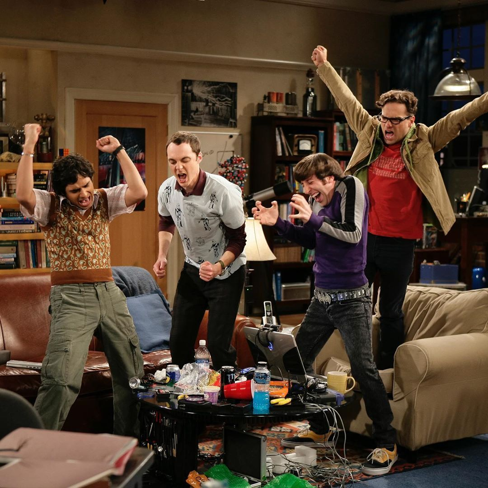

<h2><i>O que sabemos é uma gota, o que ignoramos é um oceano.  "Isaac Newton" 🔭</i></h2>

Olá, Galera!! Meu nome é <b>Lucas Chicoski</b>, amante da <b>ciência</b>, apaixonado pela <b>tecnologia</b> e <b>programando</b> agora! 🖥️ 

<h3>Formação 🎓</h3>
 
🤖 Engenharia da Computação - Multivix

 ##
 
 

 

 
  
  
  
  
  
  

 
  
  
  
  

##

 

 
  
  
   
 
  
 

